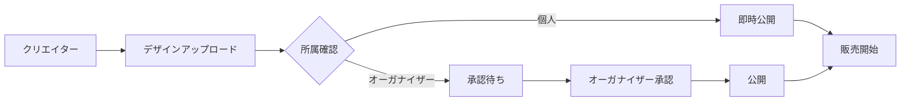
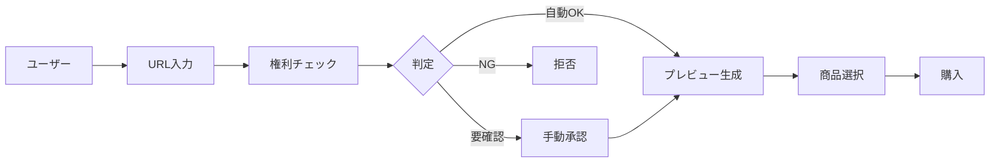

# 要件定義書 v5.0 - 推し活グッズプラットフォーム【統合版】

## 1. プロジェクト概要

### 1.1 ビジョン
推し活グッズを「作成・販売・バトル」できる総合プラットフォーム

### 1.2 主要機能
- 推し活グッズ45種類の作成・販売
- URLからの直接グッズ化
- オーガナイザーによるクリエイター管理
- リアルタイムバトル機能
- 複数製造パートナーAPI連携
- 月次支払いシステム

### 1.3 対象ユーザー
- クリエイター（個人/オーガナイザー所属）
- オーガナイザー（事務所・企業）
- 購入者（ファン）
- 管理者

## 2. ユーザーロール詳細

### 2.1 クリエイター
```ts
interface Creator {
  capabilities: {
    // 基本機能
    uploadDesign: boolean;           // デザインアップロード
    setPrice: [0, 10000];            // 価格設定範囲（円）
    createFromURL: boolean;          // URL取込

    // バトル機能
    participateInBattle: boolean;    // 要条件達成
    hostBattle: boolean;             // バトル主催

    // 管理
    viewSalesData: boolean;          // 売上閲覧
    withdrawEarnings: boolean;       // 収益引き出し
  };

  restrictions: {
    needsApproval: boolean;          // オーガナイザー承認必要
    battleEligibility: {
      isOrganizerMember: boolean;
      monthlyGoodsSold: number;      // 前月販売数
    };
  };
}
```

### 2.2 オーガナイザー
```ts
interface Organizer {
  capabilities: {
    manageCreators: boolean;          // クリエイター管理
    approveProducts: 'all';           // 全商品承認必須
    receiveBulkPayment: boolean;      // 一括支払い受領
    distributeEarnings: boolean;      // 独自配分（プラットフォーム外）

    // 追加権限
    batchApprove: boolean;            // 一括承認
    setCreatorPolicies: boolean;      // クリエイターポリシー設定
    viewAggregatedData: boolean;      // 統計閲覧
  };
}
```

### 2.3 購入者
```ts
interface Buyer {
  capabilities: {
    purchaseGoods: boolean;           // グッズ購入
    customizeProducts: boolean;       // カスタマイズ
    supportInBattle: boolean;         // バトル応援
    purchaseCheerTickets: boolean;    // 応援チケット購入

    // 特典
    exclusiveAccess: {
      signedGoods: boolean;           // サイン入りグッズ
      limitedEditions: boolean;       // 限定版
      customOptions: boolean;         // カスタムオプション
    };
  };
}
```

## 3. 商品作成フロー

### 3.1 従来型作成フロー


### 3.2 URL取込型作成フロー


### 3.3 権利判定システム
```ts
interface RightsManagement {
  autoApproved: [
    '自己所有コンテンツ',
    'Creative Commons',
    'パブリックドメイン',
    '提携サービス（許諾済み）',
    '購入済みデジタルコンテンツ'
  ];

  manualReview: [
    'ファンアート・二次創作',
    '企業ロゴ・キャラクター',
    '有名人の写真・イラスト',
    '他者のSNS投稿'
  ];

  autoRejected: [
    '著作権保護コンテンツ',
    '透かし入り画像',
    '個人情報含有',
    '違法・不適切コンテンツ'
  ];
}
```

## 4. バトル機能仕様

### 4.1 バトルシステム
```ts
interface BattleSystem {
  // 基本設定
  duration: [5, 30, 60];              // 分（選択可能）
  maxDailyBattles: 10;                // 1日最大回数
  simultaneousBattles: false;         // 同時進行不可

  // 参加条件
  eligibility: {
    requirement: 'OR',
    conditions: [
      'オーガナイザー所属',
      '前月グッズ販売10点以上'
    ]
  };

  // ポイントシステム
  scoring: {
    productPurchase: 1000,            // 商品購入
    cheerTicket: 100                  // 応援チケット
  };

  // 勝者特典
  winnerBonus: {
    revenueBoost: 20                  // 売上の20%追加
  };
}
```

### 4.2 応援チケットシステム
```ts
interface CheerTicketSystem {
  price: 100;                         // 100円固定

  benefits: {
    immediate: { battlePoints: 100 }  // バトルポイント
    exclusive: {
      signedGoodsRight: { enabled: true, quantity: 1, validity: '30days' }
      customOptions: { personalMessage: true, specialColor: true, limitedDesign: true }
    }
  };
}
```

### 4.3 パワーアップアイテム
```ts
interface PowerUpItems {
  items: [
    { name: 'ブーストタイム', effect: '30秒間ポイント5倍', price: 500, duration: 30 },
    { name: 'ステルスモード', effect: '30秒間スコア非表示', price: 300, duration: 30 },
    { name: 'サポーター召喚', effect: 'フォロワーへ緊急通知', price: 200, instant: true },
    { name: 'ダブルポイント', effect: '次回購入2倍ポイント', price: 400, oneTime: true }
  ];
}
```

## 5. 価格・手数料体系

### 5.1 通常販売
```ts
interface PricingModel {
  finalPrice: {
    formula: '製造原価 + クリエイター取り分 + 手数料',
    example: {
      manufacturingCost: 2000,     // 製造原価
      creatorMargin: 1000,         // クリエイター設定
      platformFee: 300,            // 取り分の30%
      total: 3300                  // 販売価格
    }
  };

  distribution: {
    creator: { amount: 700, percentage: 70 },
    platform: { amount: 300, percentage: 30 }
  };
}
```

### 5.2 バトル時収益
```ts
interface BattleRevenue {
  winner: { normalRevenue: 700, battleBonus: '売上の20%', total: '通常 + ボーナス' };
  additionalRevenue: { cheerTickets: 100; powerUpItems: [200, 500] };
}
```

## 6. データベース設計

### 6.1 主要テーブル構成
```sql
-- ユーザー管理
CREATE TABLE users (
  id uuid PRIMARY KEY DEFAULT gen_random_uuid(),
  email text UNIQUE NOT NULL,
  name text NOT NULL,
  role text CHECK (role IN ('creator', 'organizer', 'buyer', 'admin')),
  created_at timestamp DEFAULT now()
);

-- オーガナイザー
CREATE TABLE organizers (
  id uuid PRIMARY KEY DEFAULT gen_random_uuid(),
  name text NOT NULL,
  company_type text,
  tax_id text,
  representative_name text NOT NULL,
  contact_email text NOT NULL,
  bank_account_id uuid REFERENCES bank_accounts(id),
  approval_mode text DEFAULT 'manual',
  status text DEFAULT 'active',
  created_at timestamp DEFAULT now()
);

-- 商品
CREATE TABLE products (
  id uuid PRIMARY KEY DEFAULT gen_random_uuid(),
  creator_id uuid REFERENCES users(id),
  title text NOT NULL,
  description text,
  product_type text NOT NULL,
  price integer NOT NULL,
  creator_margin integer,
  platform_fee integer,
  status text DEFAULT 'draft',
  created_at timestamp DEFAULT now()
);

-- URL取込アセット
CREATE TABLE online_assets (
  id uuid PRIMARY KEY DEFAULT gen_random_uuid(),
  owner_user_id uuid REFERENCES users(id),
  source_url text NOT NULL,
  provider text,
  title text,
  author text,
  content_hash text UNIQUE,
  policy text CHECK (policy IN ('allow', 'deny', 'manual')),
  status text CHECK (status IN ('pending', 'approved', 'rejected', 'blocked')),
  preview_path text,
  original_path text,
  created_at timestamp DEFAULT now()
);

-- バトル
CREATE TABLE battles (
  id uuid PRIMARY KEY DEFAULT gen_random_uuid(),
  challenger_id uuid REFERENCES users(id),
  opponent_id uuid REFERENCES users(id),
  duration_minutes integer CHECK (duration_minutes IN (5, 30, 60)),
  start_time timestamp,
  end_time timestamp,
  status text CHECK (status IN ('scheduled', 'live', 'finished', 'cancelled')),
  winner_id uuid REFERENCES users(id),
  winner_bonus_amount integer,
  created_at timestamp DEFAULT now()
);

-- 応援チケット
CREATE TABLE cheer_tickets (
  id uuid PRIMARY KEY DEFAULT gen_random_uuid(),
  battle_id uuid REFERENCES battles(id),
  supporter_id uuid REFERENCES users(id),
  creator_id uuid REFERENCES users(id),
  amount integer DEFAULT 100,
  has_signed_goods_right boolean DEFAULT true,
  has_exclusive_options boolean DEFAULT true,
  exclusive_options jsonb,
  expires_at timestamp,
  purchased_at timestamp DEFAULT now()
);

-- バトル参加資格
CREATE TABLE battle_eligibility (
  user_id uuid PRIMARY KEY REFERENCES users(id),
  is_organizer_member boolean DEFAULT false,
  last_month_sales_count integer DEFAULT 0,
  is_eligible boolean GENERATED ALWAYS AS (
    is_organizer_member OR last_month_sales_count >= 10
  ) STORED,
  updated_at timestamp DEFAULT now()
);

-- 売上
CREATE TABLE sales (
  id uuid PRIMARY KEY DEFAULT gen_random_uuid(),
  product_id uuid REFERENCES products(id),
  buyer_id uuid REFERENCES users(id),
  creator_id uuid REFERENCES users(id),
  organizer_id uuid REFERENCES organizers(id),
  amount integer NOT NULL,
  platform_fee integer NOT NULL,
  net_amount integer NOT NULL,
  battle_id uuid REFERENCES battles(id),
  created_at timestamp DEFAULT now()
);

-- 支払い
CREATE TABLE payouts (
  id uuid PRIMARY KEY DEFAULT gen_random_uuid(),
  recipient_type text CHECK (recipient_type IN ('creator', 'organizer')),
  recipient_id uuid NOT NULL,
  period_start date NOT NULL,
  period_end date NOT NULL,
  gross_amount integer NOT NULL,
  platform_fee integer NOT NULL,
  net_amount integer NOT NULL,
  bank_transfer_fee integer DEFAULT 250,
  final_payout integer NOT NULL,
  status text DEFAULT 'scheduled',
  scheduled_date date NOT NULL,
  paid_at timestamp,
  created_at timestamp DEFAULT now()
);
```

## 7. API仕様

### 7.1 主要エンドポイント
```ts
interface APIEndpoints {
  // 商品管理
  products: {
    'POST /products/create': '商品作成',
    'POST /products/from-url': 'URL取込',
    'GET /products/:id': '商品詳細',
    'PUT /products/:id': '商品更新',
    'DELETE /products/:id': '商品削除'
  };

  // バトル
  battles: {
    'POST /battles/request': 'バトル申請',
    'POST /battles/:id/accept': '承認',
    'POST /battles/:id/start': '開始',
    'POST /battles/:id/action': 'アクション実行',
    'GET /battles/:id/status': '状態取得',
    'POST /battles/:id/finish': '終了'
  };

  // 決済
  payments: {
    'POST /payments/create-intent': '決済作成',
    'POST /payments/confirm': '決済確定',
    'POST /payments/cheer-ticket': '応援チケット購入',
    'POST /payments/powerup': 'パワーアップ購入'
  };

  // 管理
  admin: {
    'POST /admin/approve-product': '商品承認',
    'POST /admin/asset-policy': 'ポリシー設定',
    'POST /admin/process-payouts': '支払い処理',
    'GET /admin/metrics': 'メトリクス取得'
  };
}
```

### 7.2 WebSocket（リアルタイム通信）
```ts
interface WebSocketEvents {
  // バトル関連
  battle: {
    'battle:started': 'バトル開始通知',
    'battle:score_update': 'スコア更新',
    'battle:action': 'アクション実行',
    'battle:powerup_activated': 'パワーアップ発動',
    'battle:finished': 'バトル終了'
  };

  // 通知
  notifications: {
    'notification:battle_request': 'バトル申請受信',
    'notification:product_approved': '商品承認',
    'notification:payment_received': '支払い受領'
  };
}
```

## 8. セキュリティ要件

### 8.1 RLS（Row Level Security）ポリシー
```sql
-- 商品アクセス制御
CREATE POLICY products_access ON products
  FOR SELECT USING (
    status = 'published' OR
    creator_id = auth.uid() OR
    EXISTS (
      SELECT 1 FROM organizer_members
      WHERE organizer_id IN (
        SELECT organizer_id FROM products WHERE id = products.id
      ) AND user_id = auth.uid()
    )
  );

-- バトル参加制御
CREATE POLICY battle_participation ON battles
  FOR INSERT WITH CHECK (
    EXISTS (
      SELECT 1 FROM battle_eligibility
      WHERE user_id = auth.uid() AND is_eligible = true
    )
  );

-- 売上データアクセス
CREATE POLICY sales_access ON sales
  FOR SELECT USING (
    creator_id = auth.uid() OR
    buyer_id = auth.uid() OR
    organizer_id IN (
      SELECT organizer_id FROM organizer_members
      WHERE user_id = auth.uid()
    ) OR
    EXISTS (SELECT 1 FROM users WHERE id = auth.uid() AND role = 'admin')
  );
```

### 8.2 画像保護
```ts
interface ImageProtection {
  watermark: { enabled: true; opacity: 0.3; text: 'SAMPLE'; position: 'center' };
  access: {
    preview: 'public_with_watermark';
    original: 'manufacturing_only';
    storage: { private: 'photos-original'; public: 'photos-watermarked' };
  };
}
```

## 9. 外部連携

### 9.1 製造パートナー
```ts
interface ManufacturingPartners {
  suzuri: { api: 'https://suzuri.jp/api/v1'; products: ['tshirt','mug','sticker']; leadTime: '7-10 days' };
  pixivFactory: { api: 'https://factory.pixiv.net/api'; products: ['acrylic_stand','badge','tapestry']; leadTime: '10-14 days' };
  printful: { api: 'https://api.printful.com'; products: ['hoodie','poster','phone_case']; leadTime: '5-7 days' };
}
```

### 9.2 決済システム
```ts
interface PaymentIntegration {
  stripe: {
    publicKey: process.env.STRIPE_PUBLIC_KEY,
    webhooks: [ 'payment_intent.succeeded', 'payment_intent.failed', 'charge.refunded' ],
    supportedMethods: [ 'card', 'apple_pay', 'google_pay' ]
  };
}
```

## 10. 実装フェーズ

- Phase 1: 基盤構築（1週間）
  - データベース設計・構築／認証・認可／基本API／画像処理・透かし
- Phase 2: 商品機能（1週間）
  - 従来型作成フロー／URL取込機能／権利判定システム／製造API連携
- Phase 3: バトル機能（1週間）
  - バトルマッチング／リアルタイムスコア／応援チケット・パワーアップ／WebSocket
- Phase 4: 支払い・管理（5日）
  - 月次集計／振込処理／オーガナイザー管理画面／管理者ダッシュボード
- Phase 5: 最適化・テスト（3日）
  - パフォーマンス最適化／セキュリティ監査／負荷テスト／バグ修正

## 11. 成功指標（KPI）
```ts
interface KPIs {
  business: {
    monthlyGMV: '月間流通総額';
    averageOrderValue: '平均注文額';
    creatorRetention: 'クリエイター継続率';
    conversionRate: '購入転換率';
  };
  engagement: {
    dailyActiveBattles: '1日あたりバトル数';
    cheerTicketSales: '応援チケット売上';
    averageBattleViewers: '平均バトル視聴者数';
    socialShares: 'SNSシェア数';
  };
  technical: {
    pageLoadTime: '<2秒';
    apiResponseTime: '<200ms';
    uptime: '>99.9%';
    errorRate: '<0.1%';
  };
}
```

## 12. リスク管理
```ts
interface RiskManagement {
  legal: {
    copyright: '権利侵害の監視・対応';
    takedown: '削除要請への24時間対応';
    terms: '利用規約の定期更新';
  };
  technical: {
    scaling: 'トラフィック増加への自動スケーリング';
    backup: '日次バックアップ';
    monitoring: '24/7監視体制';
  };
  business: {
    fraud: '不正取引の検知・防止';
    quality: '製造品質の管理';
    support: 'カスタマーサポート体制';
  };
}
```

---
本ドキュメントは v4.0（URL選択→グッズ化）および v3.1（クリエイター出品）を統合し、バトル機能を含む包括要件を定義します。詳細設計（スキーマ/RLS/関数/API I/F）と実装計画は本書の各章を基に具体化します。

## 付録A. 直近変更に伴う要件更新（2025-09）

### A.1 ナビゲーション/メニュー要件
- グローバルメニューは以下ページに設置し、ラベルは「メニュー」固定。
  - トップ（`/#merch`）、商品マーケットプレイス（`/#products-marketplace`）、クリエイターダッシュボード（`/#creator-dashboard`）
- ドロップダウンはテキスト色を黒（`text-gray-900`）、外側クリックまたは Esc キーでクローズできること。
- メニュー項目はルートメタ（ROUTES_META）に基づく自動生成とし、権限に応じて表示制御する。
- ブランド表記: ヘッダーロゴから装飾絵文字（✨）を削除。ロゴクリック/アンカーは `#merch` へ遷移。

### A.2 認証・遷移要件
- ログアウト時は必ずトップ（`/#merch`）へ遷移すること。
- 未認証ユーザーがいずれかのダッシュボード（general/creator/factory/organizer/admin）へ遷移した場合、トップ（`/#merch`）へリダイレクトすること。
- 一般ユーザー（guest相当）に対するフォールバック先は `/#merch` とする。

### A.3 E2E テスト要件（Playwright）
- Smoke: `/#merch` へアクセスし、アプリ名（PhotoRank）が可視であること。
- Guard: 未認証状態で `/#creator-dashboard` へアクセスすると `/#merch` に戻ること。
- 実行時の `BASE_URL` は環境変数で指定（デフォルト `http://localhost:5173`）。

### A.4 セキュリティ/DB 要件（運用方針）
- public スキーマの内部テーブルは RLS 有効化 + deny-all ポリシーで保護（例: `schema_migrations`, `simple_rate_limits`）。
- `manufacturing_order_status_history` は RLS を有効にし、認可は service_role に限定する（JWT クレーム `role=service_role` を用いた USING/ WITH CHECK）。
- 拡張 `pg_trgm` は `extensions` スキーマに配置（`ALTER EXTENSION pg_trgm SET SCHEMA extensions;`）。
- public 関数は役割の search_path に依存しないよう、`SET search_path TO pg_catalog, public` を付与（ALTER FUNCTION）。
